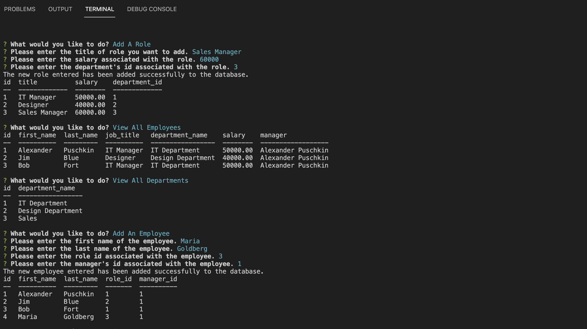

# Employee Tracker

## Relevant Links

Please find the relevant links here:

- Demo Video of the App: [Click Here](https://drive.google.com/file/d/1NalrcY_-cWTmSPk63r4cQ4IPFZYWZkbo/view?usp=sharing)

- Repository on Github: [Click Here](https://github.com/alexanderpuschkinberlin/employee-management-system/)

## Description

The Employee Tracker App is an application built on the base of Node.js and the Express package. It delivers a basic interface within the terminal to manage lists with departments, roles and employees - and also the relation between those data points.

## Technologies used:

- Javascript
- Node.js
- Express Package
- Inquirer Package
- MySQL2 Package
- Console Table Package

## Screenshot



## Instructions :

- Clone this repository to use this application on local machine.

- To install necessary dependencies, run the following command:

```
npm i
```

- Make sure a MySQL database instance is running
- run the schema.sql to prepare the database and its tables
- The application will start with the following command:

```
node main.js or npm run start
```

---

© 2022 Alexander Puschkin | All Rights Reserved.
